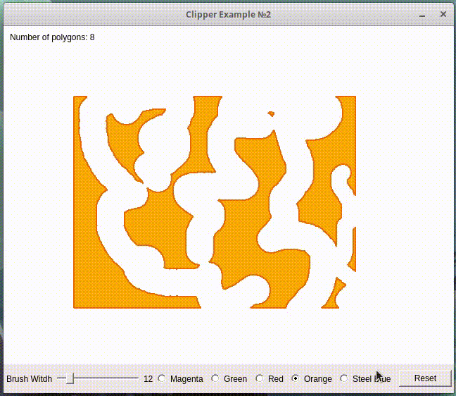

# Clipper example in Qt (Linux)
Qt version 5.7.1  
Clipper library version: 6.1.3  
  
Example 1 - Clipper  
  
  
Example 2 - Clipper + Appearance  
  
  
Example 3 - Clipper + Poly2Tri + Box2D + Appearance  
  
  
